# Security Architecture

How the Hop Infrastructure Suite achieves production-grade security through simplicity.

## Design Philosophy

Traditional orchestrators solve multi-tenancy with complex software controls (RBAC, NetworkPolicy, service mesh). Hop takes a different approach: **physical separation over logical separation.**

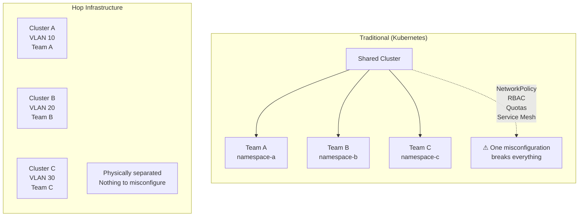

## Defense in Depth (4 Layers)

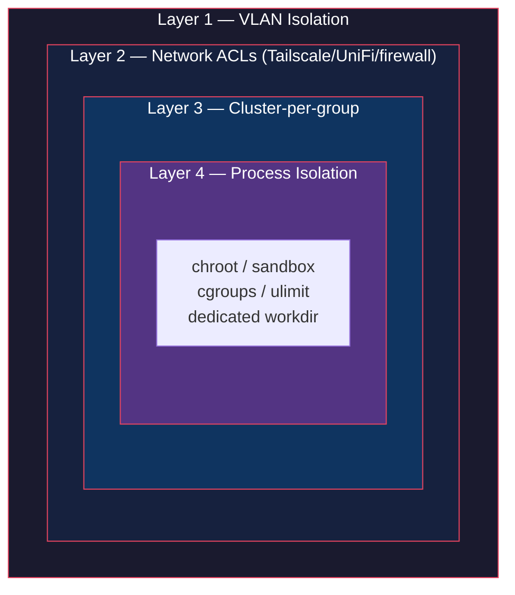

Each layer is independent, proven, and explainable in one sentence:

| Layer | Technology | Proven since | One-sentence explanation |
|-------|-----------|-------------|--------------------------|
| 1 | VLAN | 1998 | Network traffic physically separated at the switch |
| 2 | Encrypted network | VPN/WireGuard | Encrypted access with site-to-site connectivity |
| 3 | Cluster-per-group | Architecture | Each team owns their cluster, nothing shared |
| 4 | chroot/sandbox/cgroups | 1982/2007 | OS-level process isolation and resource limits |

## Layer 1: VLAN Isolation

Each application group runs in its own VLAN. Layer 2 network isolation — the most battle-tested isolation primitive in networking.

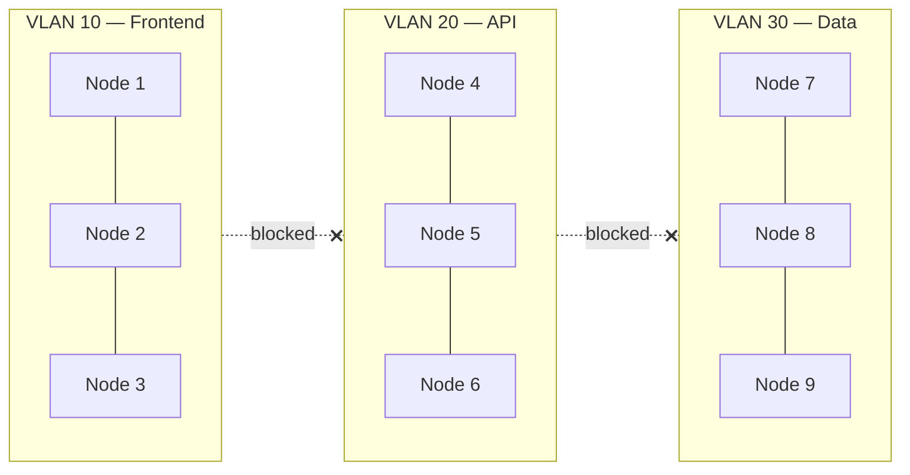

**What it provides:**
- Complete network separation between application groups
- No cross-group traffic possible at the network level
- No software misconfiguration can break this boundary
- Standard switch/router configuration, nothing custom

**Auditor conversation:**
> "How are your environments separated?"
> "Each cluster runs in its own VLAN."
> "Next question."

## Layer 2: Encrypted Network (Your Choice)

Layer 2 provides encrypted connectivity and access control. Multiple options, same security guarantees:

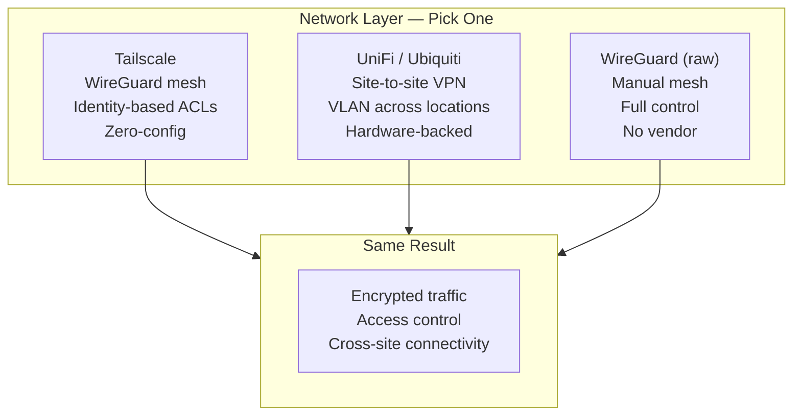

| Option | Strength | Best for |
|--------|----------|----------|
| **Tailscale** | Identity-based ACLs, zero-config, SSO | Cloud-native teams, remote access |
| **UniFi/Ubiquiti** | Hardware VPN, VLAN mesh across sites, no external dependency | On-premise, multi-site, full ownership |
| **WireGuard (raw)** | No vendor, full control | Teams that want maximum control |
| **IPsec/OpenVPN** | Legacy compatibility | Existing infrastructure |

**What any of these provide:**
- **Encryption**: All inter-node traffic encrypted
- **Access control**: Who/what can reach which cluster
- **Cross-site**: Connect VLANs across physical locations
- **Isolation**: Combined with VLAN = network-level separation

### Ubiquiti example (multi-site VLAN mesh)

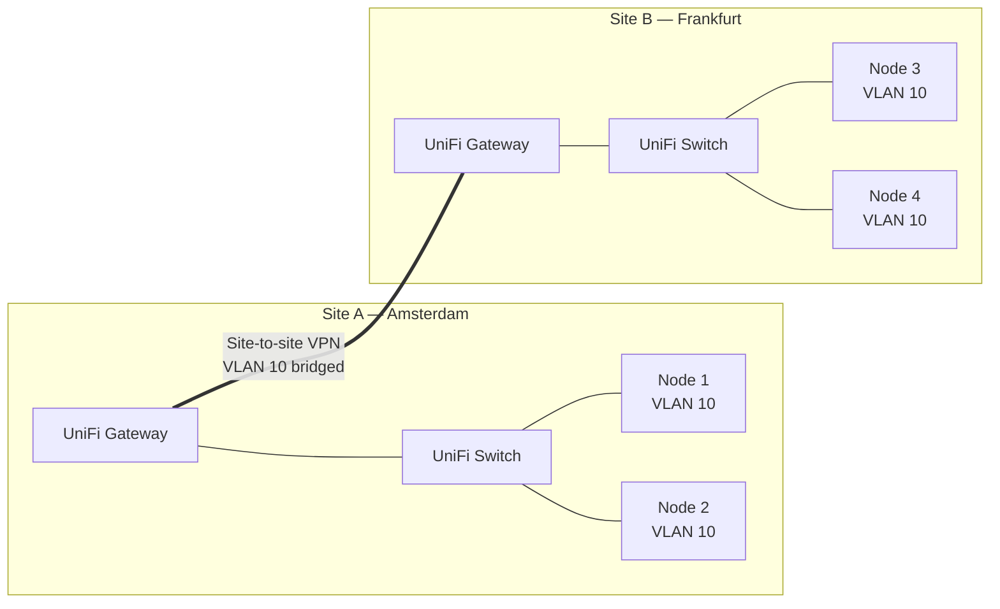

Same VLAN, two sites, hardware-encrypted tunnel. Nodes 1-4 are in the same cluster — hop sees no difference between local and remote nodes.

### Tailscale example (identity-based)

```json
{
  "acls": [
    {"action": "accept", "src": ["tag:admin"],      "dst": ["tag:hop:*"]},
    {"action": "accept", "src": ["tag:deploy"],      "dst": ["tag:hop:8080"]},
    {"action": "accept", "src": ["tag:monitoring"],   "dst": ["tag:hop:9090"]}
  ]
}
```

**Key point:** Hop does not depend on any specific network solution. VLAN isolation works with any vendor or technology. Pick what fits your infrastructure.

## Layer 3: Cluster-per-Application-Group

Instead of isolating workloads within a shared cluster, each application group gets its own cluster.

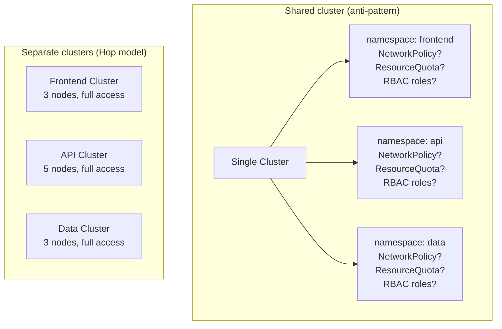

**Why this is better than namespace isolation:**

| Shared cluster + namespaces | Separate clusters |
|-----------------------------|-------------------|
| 1 misconfigured NetworkPolicy = breach | Physically impossible to cross |
| RBAC complexity grows with teams | No RBAC needed — it's your cluster |
| Noisy neighbor (CPU/memory) | Dedicated resources |
| Single upgrade affects everyone | Independent upgrades |
| Complex audit trail | Simple: who accessed which cluster |

## Layer 4: Process Isolation

Each task runs with OS-level isolation:

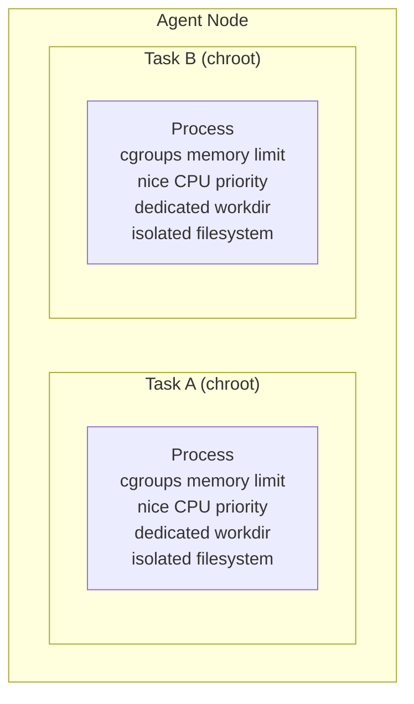

| Platform | Filesystem | Memory | CPU |
|----------|-----------|--------|-----|
| Linux | `chroot` jail | `cgroups v2` (OOM killer) | `nice` priority |
| macOS | `sandbox-exec` | `ulimit` | `nice` priority |

## Secrets Management

Hop does not store secrets. Secrets are injected at deploy time via external secrets managers.

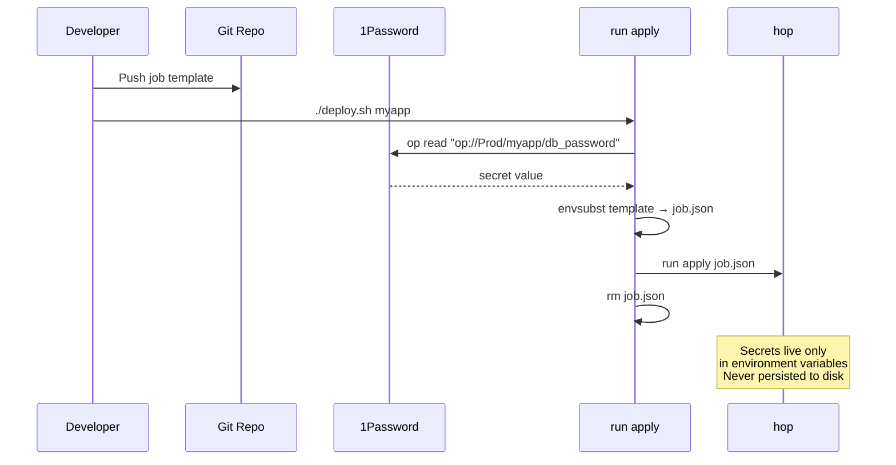

**What this means for compliance:**
- No secrets at rest in the orchestrator
- Secrets rotation handled by the secrets manager
- Audit trail for secret access is in 1Password/Vault, not in Hop

## Attack Surface Comparison

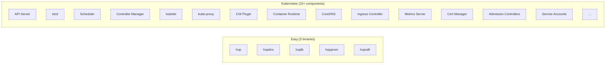

| Metric | Hop | Kubernetes |
|--------|------|------------|
| Components | 5 binaries | 15+ components |
| External dependencies | 3 Go libraries | Hundreds (CRI, CNI, CSI, ...) |
| Open ports | 0 (VPN/VLAN) | API server, etcd, kubelet, ... |
| CVEs per year | Minimal (small codebase) | 20+ (large attack surface) |
| Config parameters | <10 | 100+ |
| Can fully audit codebase | Yes | No (millions of lines) |

**The security advantage of simplicity:** a system you can fully understand is a system you can fully secure.

## Compliance Mapping

### SOC 2 Type II

| Trust Service Criteria | Hop Implementation |
|------------------------|---------------------|
| **CC6.1** Logical access | Network ACLs (Tailscale/UniFi/firewall) |
| **CC6.2** Access credentials | VPN device keys + 1Password |
| **CC6.3** Access removal | Device/key removal = instant revoke |
| **CC6.6** System boundaries | VLAN per cluster + Network ACLs (Tailscale/UniFi/firewall) |
| **CC6.7** Data transmission | WireGuard encryption (all traffic) |
| **CC7.1** Threat detection | hopprom + Prometheus alerting |
| **CC7.2** Monitoring | hopprom metrics, network/VPN access logs |
| **CC8.1** Change management | Git-based deploys, `run apply` from version control |
| **A1.2** Recovery | Auto-restart, leader failover, state persistence |

### ISO 27001

| Control | Hop Implementation |
|---------|---------------------|
| **A.9.1** Access control policy | Network ACLs (Tailscale/UniFi/firewall) + cluster-per-group |
| **A.9.2** User access management | VPN/network identity management |
| **A.10.1** Cryptographic controls | WireGuard encryption (all traffic) |
| **A.12.1** Operational procedures | `run apply` from git, repeatable deploys |
| **A.12.4** Logging and monitoring | hopprom + Prometheus + network/VPN logs |
| **A.13.1** Network security | VLAN isolation + encrypted network layer |
| **A.14.2** Secure development | Static binaries, minimal dependencies |
| **A.17.1** Continuity | Multi-node clusters, auto-failover |

### HIPAA

| Safeguard | Hop Implementation |
|-----------|---------------------|
| **Access control** | VPN identity + network ACLs |
| **Audit controls** | Network/VPN logs + hopprom metrics |
| **Integrity controls** | Encrypted transport (WireGuard) |
| **Transmission security** | All traffic encrypted by default |
| **Workstation security** | VPN/network device authorization |

### Gaps to Address

| Gap | Required for | Solution |
|-----|-------------|----------|
| Audit log (who deployed what) | SOC 2, ISO 27001 | Add logging to CLI (`run apply` logs to file/syslog) |
| Deploy approval workflow | SOC 2 (change management) | Git PR approval before `run apply` |
| Encryption at rest | HIPAA, PCI DSS | OS-level disk encryption (LUKS/FileVault) |
| Vulnerability scanning | All | External tooling (Trivy, Grype) |
| Penetration test report | SOC 2, ISO 27001 | Commission annually |
| Security policy documentation | All | Document your ISMS |

Most gaps are **documentation and process**, not technology.

## Security Monitoring

hopprom + Prometheus provides security-relevant alerting:

```yaml
groups:
  - name: security
    rules:
      # Unexpected agent (possible unauthorized node)
      - alert: UnknownAgent
        expr: hop_agents_total > expected_agent_count
        for: 1m
        labels:
          severity: critical
        annotations:
          summary: "Unexpected agent count: {{ $value }}"

      # High failure rate (possible attack or misconfiguration)
      - alert: HighFailureRate
        expr: rate(hop_task_failures_total[5m]) > 1
        for: 5m
        labels:
          severity: warning

      # Agent down (possible infrastructure issue)
      - alert: AgentDown
        expr: hop_agents_healthy < hop_agents_total
        for: 2m
        labels:
          severity: critical
```

## Deployment Security Checklist

### Per cluster

- [ ] Dedicated VLAN configured
- [ ] Network ACLs (Tailscale/UniFi/firewall) defined and reviewed
- [ ] hopraft API key generated and secured
- [ ] Secrets injected via 1Password/Vault (never in job configs)
- [ ] Disk encryption enabled on all nodes (LUKS/FileVault)
- [ ] hopprom + Prometheus alerting configured
- [ ] Firewall rules: only VPN/VLAN traffic allowed

### Per application

- [ ] Static binary verified (`ldd` → "not a dynamic executable")
- [ ] Health check configured
- [ ] Resource limits set (CPU shares + memory limit)
- [ ] Artifact downloads authenticated (S3 auth / HTTP headers)
- [ ] Environment variables via secrets manager, not hardcoded

### Organizational

- [ ] Deploy process via git (PR + approval + `run apply`)
- [ ] Access reviews scheduled (VPN/network device audit)
- [ ] Incident response plan documented
- [ ] Backup/recovery procedure tested
- [ ] Penetration test scheduled annually

## Scaling Through Constant Complexity

Traditional orchestrators become harder to secure as they grow. More tenants = more RBAC rules, more NetworkPolicies, more audit complexity. Hop's cluster-per-group model means **security complexity is O(1), not O(n).**

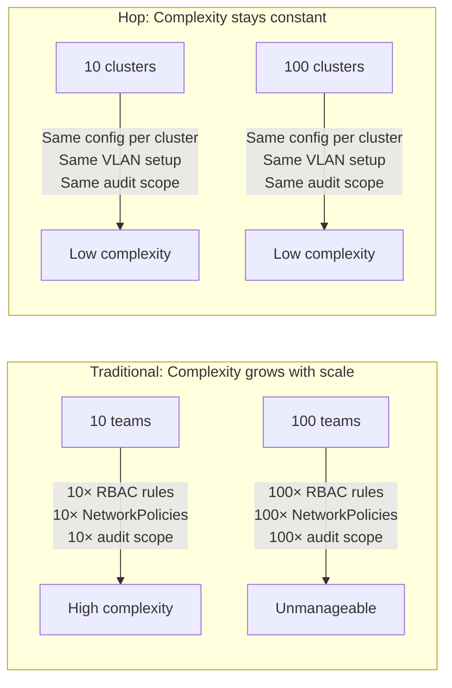

**Why this works:**

| Aspect | Shared cluster (traditional) | Cluster-per-group (Hop) |
|--------|------------------------------|--------------------------|
| Adding a team | New RBAC roles, NetworkPolicies, quotas, audit rules | New VLAN + new cluster (identical config) |
| Security audit | Audit grows linearly with tenants | Audit one cluster = audit all clusters |
| Blast radius | One misconfiguration affects everyone | One cluster's issue stays in that cluster |
| Compliance scope | Entire shared cluster is in scope | Only the relevant cluster is in scope |

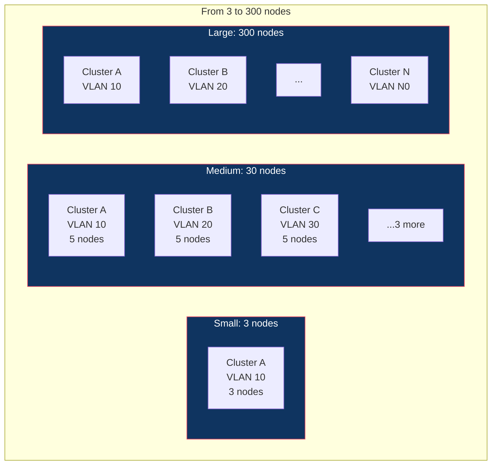

**The key insight:** scaling from 3 to 300 nodes doesn't mean one cluster with 300 nodes. It means more clusters, each with the same simple, auditable configuration. The security posture of cluster #50 is identical to cluster #1 — same VLAN setup, same process isolation, same deployment checklist.

**For compliance, this is a superpower:** auditors don't need to understand a growing set of policies. They audit one cluster template, and that audit covers all clusters.

## Summary

Hop's security model is built on **proven, simple, auditable** layers:

| Layer | Technology | Age | Complexity |
|-------|-----------|-----|------------|
| Network | VLAN | 25+ years | Switch config |
| Encryption | VPN (WireGuard/IPsec/UniFi) | Proven | Standard infra |
| Isolation | Cluster-per-group | Architecture | Nothing to configure |
| Process | chroot/sandbox/cgroups | 40+ years | OS primitives |

No RBAC policies to misconfigure. No NetworkPolicies to audit. No service mesh certificates to rotate. Just layers of proven technology, each independently verifiable.

**The simplest system to secure is the smallest system to understand.**
