# EasyRun Sequence Diagrams

Overzicht van alle belangrijke call flows in easyrun, inclusief de volgorde waarin componenten elkaar aanroepen.

## Inhoudsopgave

- [1. Agent Startup](#1-agent-startup)
- [2. Leader Election (becomeLeader)](#2-leader-election-becomeleader)
- [3. Heartbeat Loop](#3-heartbeat-loop)
- [4. Agent Registration](#4-agent-registration)
- [5. Job Dispatch (nieuw)](#5-job-dispatch-nieuw)
- [6. Job Update (Rolling)](#6-job-update-rolling)
- [7. Job Update (Recreate)](#7-job-update-recreate)
- [8. Job Update (Blue-Green)](#8-job-update-blue-green)
- [9. Job Delete](#9-job-delete)
- [10. Task Monitoring & Restart](#10-task-monitoring--restart)
- [11. Dead Agent Detection & Reconciliation](#11-dead-agent-detection--reconciliation)
- [12. Leader Failover](#12-leader-failover)
- [13. Proxy to Leader (easydns/easylb/easyprom)](#13-proxy-to-leader)
- [14. Agent Isolation (network split)](#14-agent-isolation-network-split)
- [Bevindingen: Volgordes & Mogelijke Issues](#bevindingen)

---

## 1. Agent Startup

Wat er gebeurt wanneer een easyrun agent proces start.

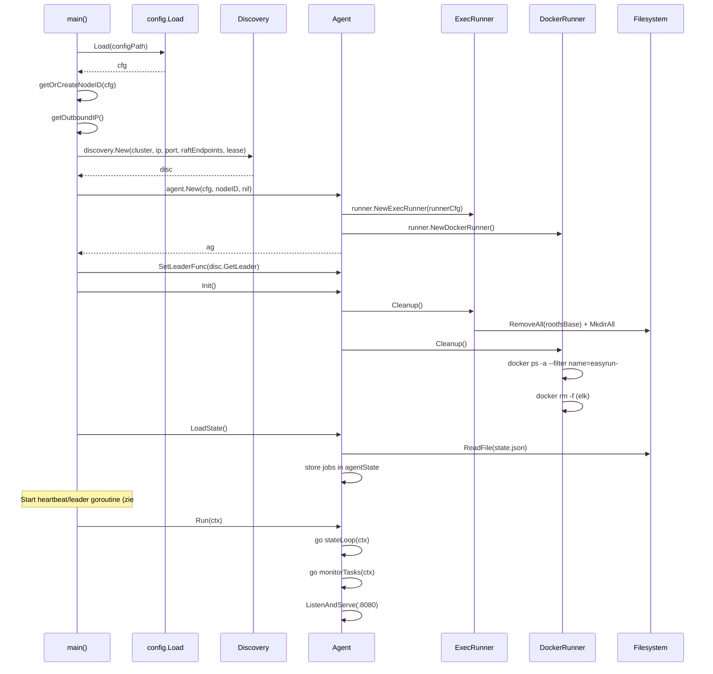

---

## 2. Leader Election (becomeLeader)

Wat er gebeurt wanneer een agent succesvol leader wordt.

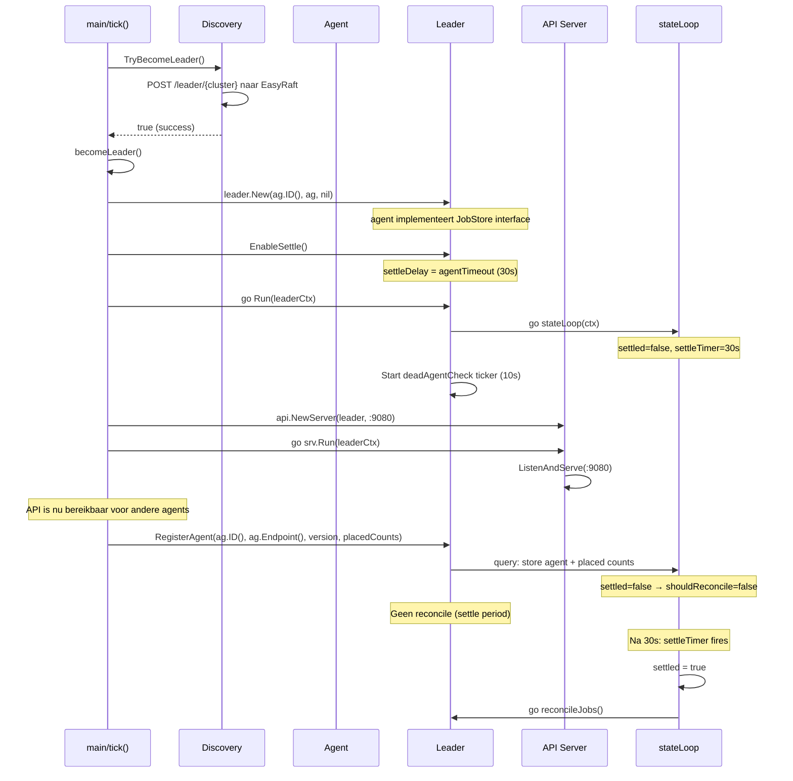

**Kritieke volgorde:** `go l.Run()` MOET voor `RegisterAgent()` starten. Anders deadlock: RegisterAgent doet een `query()` op de ops channel, maar stateLoop leest er nog niet van.

---

## 3. Heartbeat Loop

De main loop die elke 10 seconden draait op elke agent.

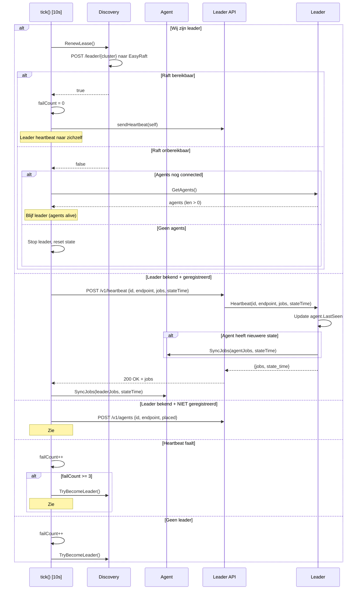

---

## 4. Agent Registration

Wanneer een agent zich (opnieuw) registreert bij de leader.

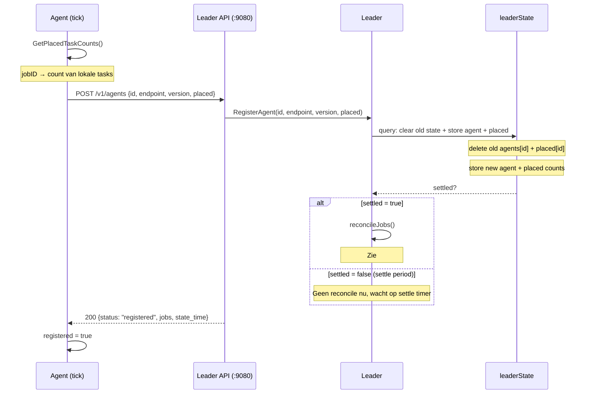

---

## 5. Job Dispatch (nieuw)

Wanneer een nieuwe job wordt aangemaakt via CLI of API.

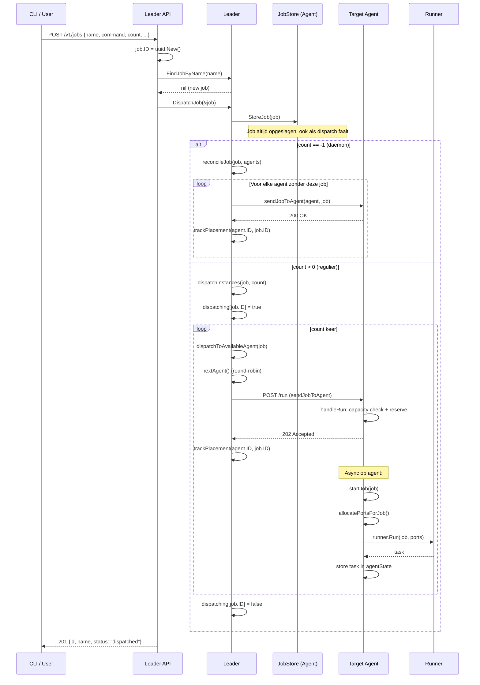

---

## 6. Job Update (Rolling)

Zero-downtime rolling update: 1 instance tegelijk vervangen.

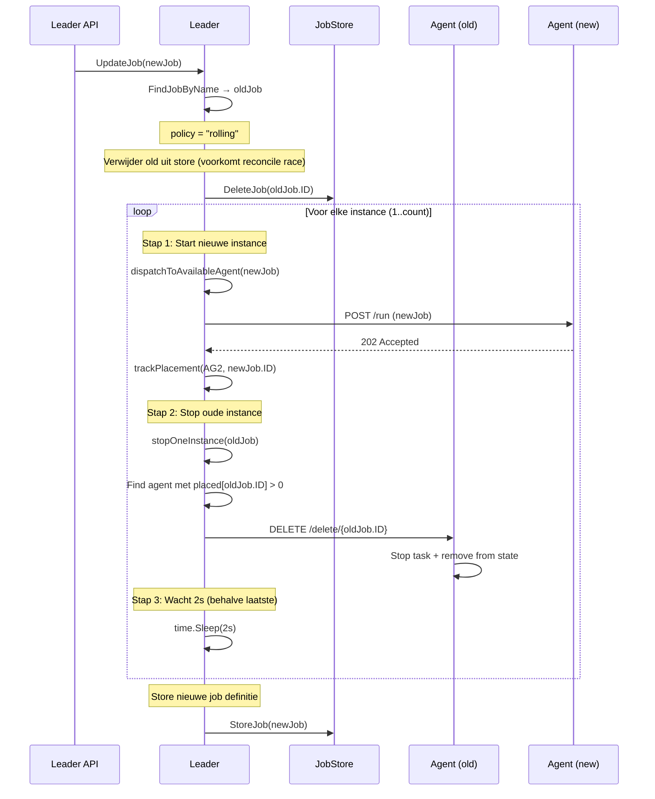

**Volgorde per instance:** dispatch new → stop old → delay. Dit garandeert dat er altijd minstens N-1 instances draaien.

**Waarom DeleteJob eerst?** De oude job wordt direct uit de store verwijderd zodat `reconcileJobs` (als het triggert tijdens de update) niet probeert extra oude instances te dispatchen. De in-memory `oldJob` referentie is genoeg voor `stopOneInstance`.

---

## 7. Job Update (Recreate)

Simpele update met downtime: alles stoppen, dan alles starten.

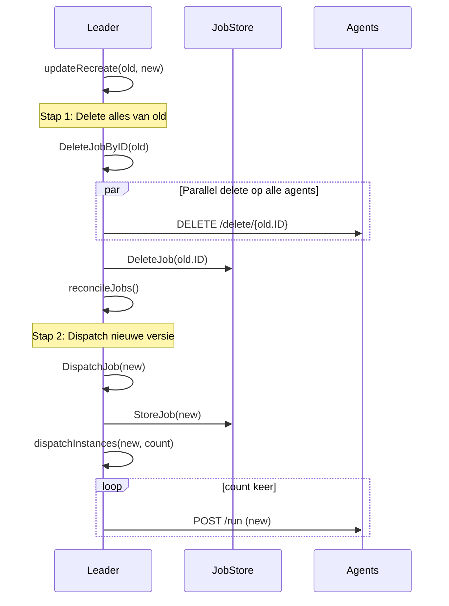

---

## 8. Job Update (Blue-Green)

Zero-downtime met 2x resources: start alles nieuw, dan stop alles oud.

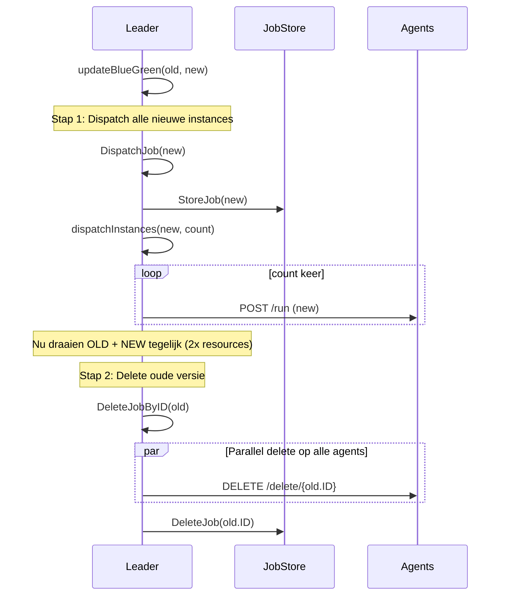

---

## 9. Job Delete

Verwijderen van een job en alle bijbehorende tasks.

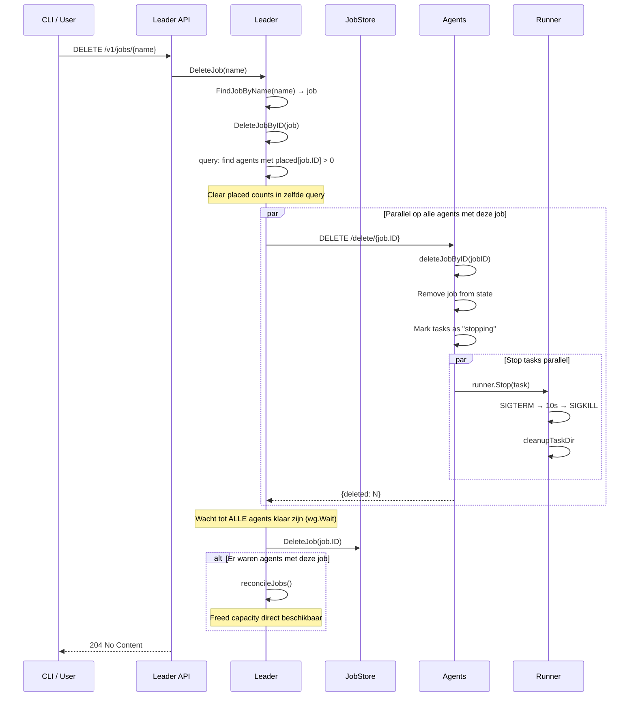

---

## 10. Task Monitoring & Restart

De agent monitort elke 5 seconden alle running tasks.

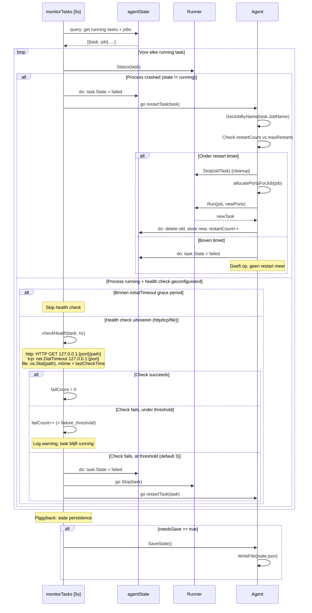

---

## 11. Dead Agent Detection & Reconciliation

De leader controleert elke 10 seconden of agents nog leven.

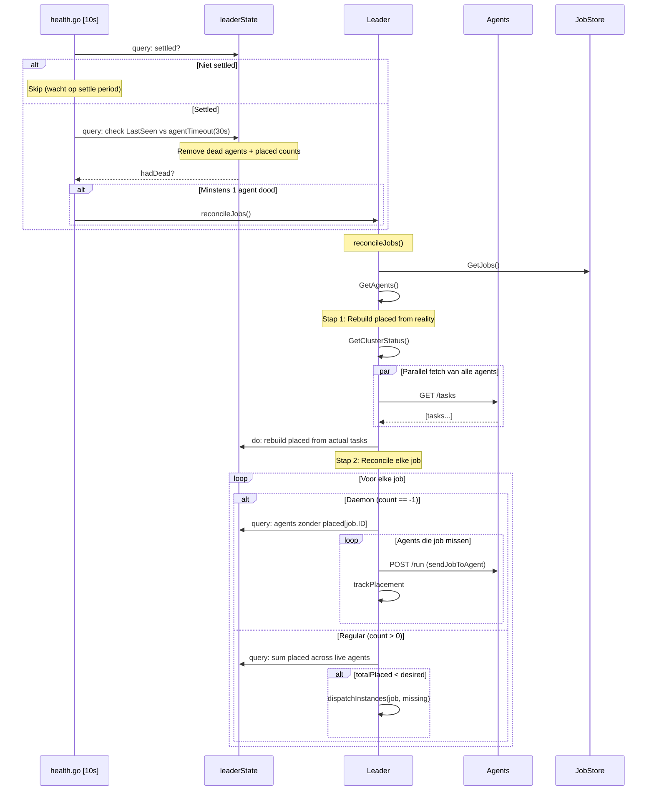

---

## 12. Leader Failover

Complete flow wanneer de leader crasht en een andere agent het overneemt.

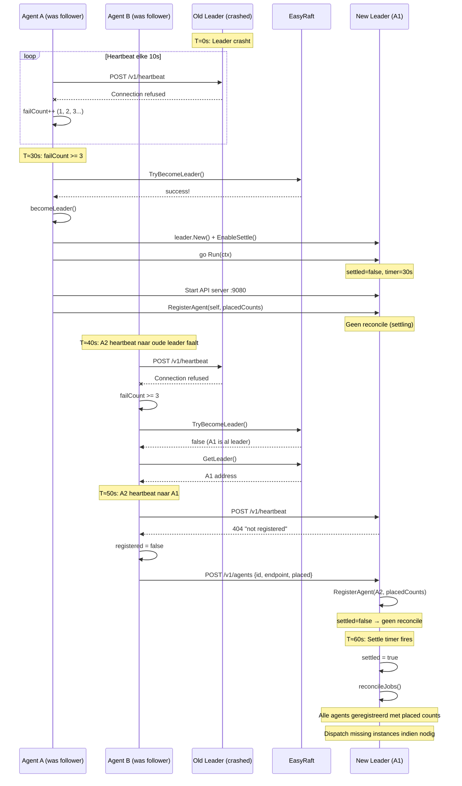

---

## 13. Proxy to Leader

Hoe easydns/easylb/easyprom cluster data opvragen via hun lokale agent.

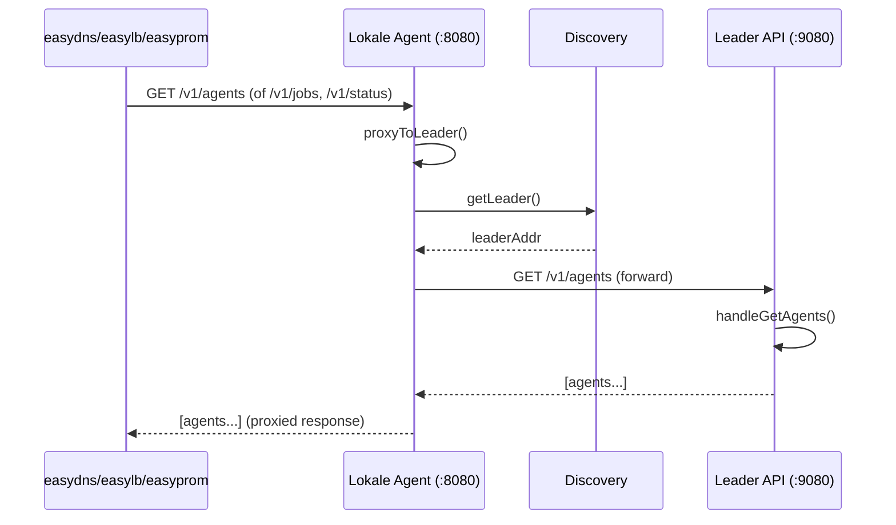

---

## 14. Agent Isolation (network split)

Wat er gebeurt wanneer een agent volledig geisoleerd raakt.

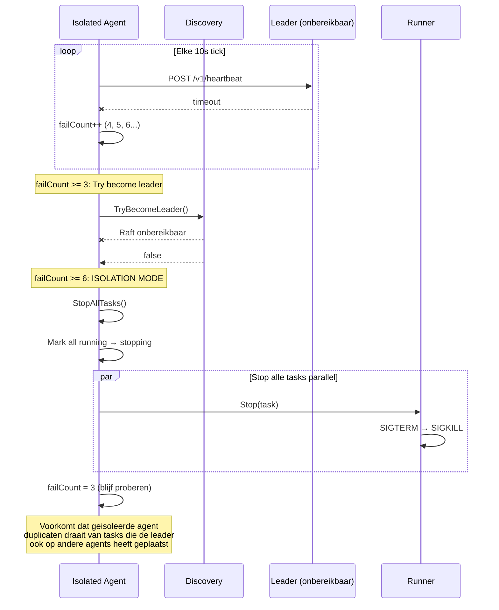

---

## Bevindingen

### Volgordes die correct zijn

1. **becomeLeader**: `go l.Run()` start VOOR `RegisterAgent()` — voorkomt deadlock op ops channel.

2. **Init() volgorde**: `Cleanup()` (exec + docker) → `LoadState()` → `Run()`. Clean slate van processen, dan pas state laden.

3. **Capacity reservation**: `handleRun` doet capacity check + reserve in 1 atomaire `query()` — voorkomt TOCTOU race bij concurrent dispatch.

4. **Task stop volgorde**: Mark als "stopping" in state (voorkomt restart door monitor) → dan pas `runner.Stop()`.

5. **Rolling update volgorde**: dispatch new → stop old → delay. Garandeert minimaal N-1 instances.

6. **Delete volgorde**: Stop tasks op alle agents (parallel, `wg.Wait`) → delete job uit store → reconcile. Garandeert dat capacity vrij is voor reconcile.

7. **Settle period**: Leader wacht 30s na election voordat reconcileJobs draait. Geeft agents tijd om te registreren met placed counts. Voorkomt dubbele dispatches.

8. **Heartbeat 404 → re-register**: Agent detecteert nieuwe leader correct en re-registreert met placed counts.

