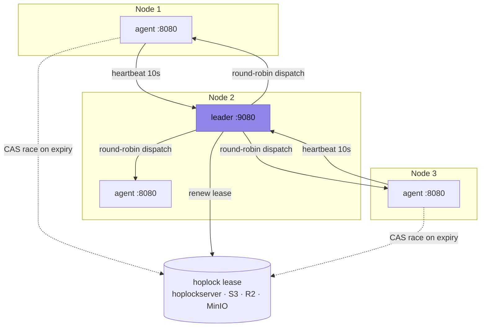
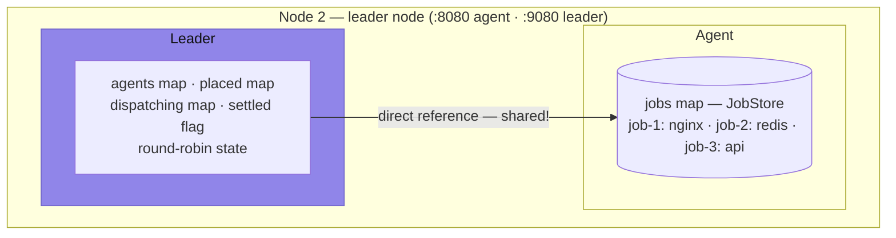
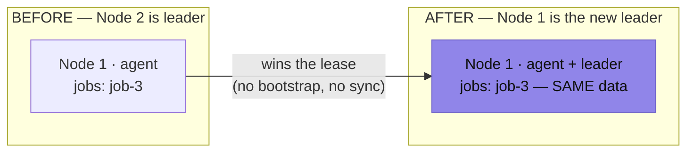
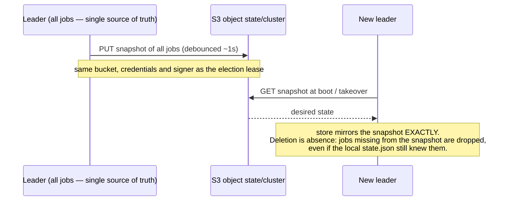
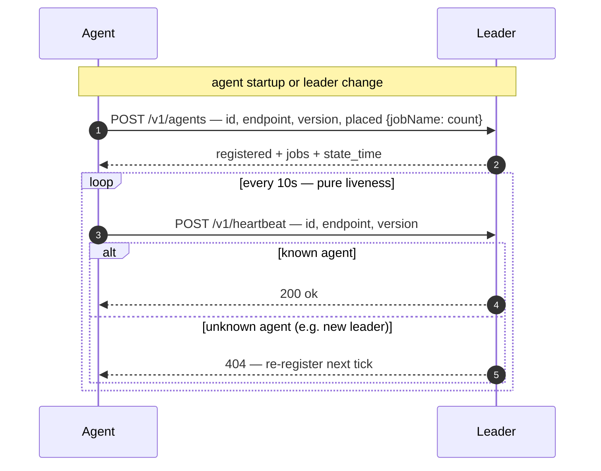
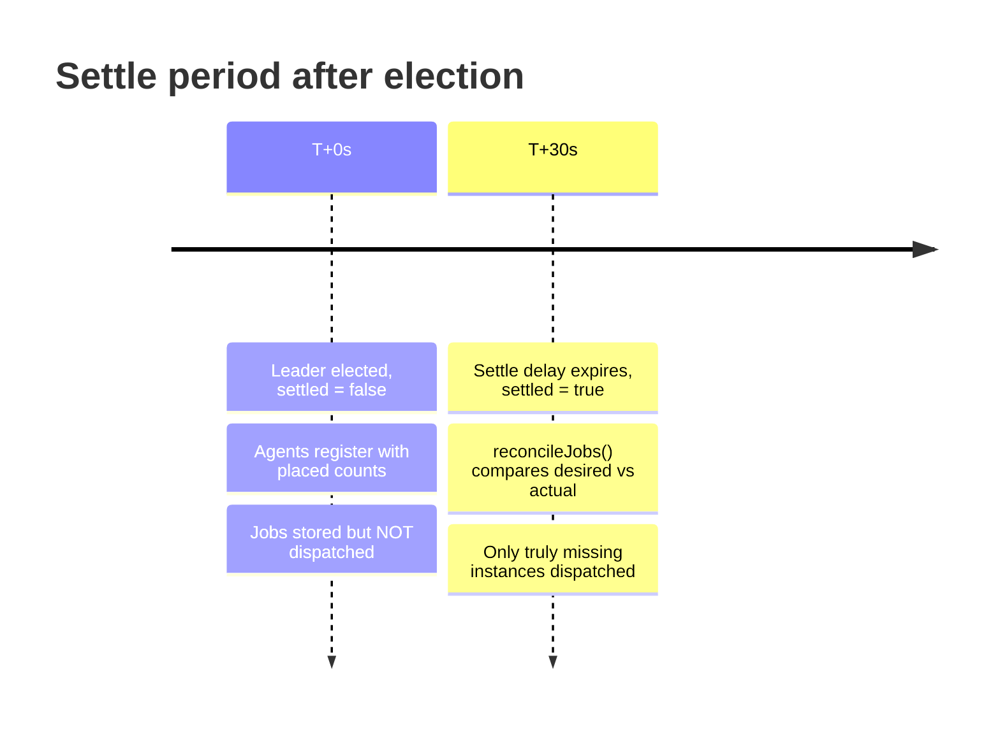

# Architecture



## Node with Leader Role (Shared State)



## Leader Failover (no bootstrap needed)



No sync needed — the agent **becomes** leader, not a separate entity: the
leader reads the agent's own jobs map directly.

## Committed State (single author: the leader)



- The leader is the **only author** of desired state. Agents are executors;
  they never send job definitions back (the old bidirectional heartbeat
  sync bred delete-resurrection zombies and was removed).
- Snapshot writes are debounced (~1s), so a crash loses at most the newest
  mutations — visible declaratively (the job is absent) and re-submittable.
- Renaming or deleting the state object in the bucket is the operator's
  "boot clean" switch. See `internal/leader/persist.go`.
- Without usable S3 config there is no committed state: a new leader then
  only knows the jobs in its own local store.

### Init jobs (clean boot → baseline)

A leader that starts with **no snapshot and an empty job store** seeds the
jobs from `cluster.init_jobs` (config) once, through the normal dispatch
path. This is how a blank node (Pi, HopOS) comes up with its baseline
without anyone running `run apply`. It is one-shot, not enforcement:
deleting a seeded job sticks until the next clean boot, and a store *error*
never triggers a seed (an S3 outage must not reset the cluster). See
`internal/leader/init.go` and [configuration.md](configuration.md#init-jobs).

## Registration Protocol



**Registration vs Heartbeat:**
- Registration (POST /v1/agents): includes `placed` counts, triggers reconciliation
- Heartbeat (POST /v1/heartbeat): updates LastSeen only (pure liveness), no job exchange, no reconciliation

## Settle Period



Without settle the leader doesn't know what agents are already running →
it would dispatch everything → duplicates.

## Components

### hoplock (leader election)
- Lease-based election: CAS (compare-and-swap) over a blob store — no quorum, no log replication
- Backends: `hoplockserver` (mini HTTP server, default), any S3-compatible store (AWS/R2/MinIO/B2), or in-memory (`--standalone`)
- Each agent reads the lease blob periodically; on expiry, one agent wins the conditional write and becomes leader
- The blob store IS the truth — HA comes from the store, not from hop

### Leader
- Node that holds the hoplock lease
- Receives heartbeats from agents
- Dispatches regular jobs via deterministic round-robin (agents sorted by ID)
- Dispatches daemon jobs (count=-1) via reconcile-based dispatch
- Tracks which job instances run on which agents (placed map: agentID → jobName → count)
- On agent failure: cleans stale placement, reconciles all jobs
- Runs on port+1000 (default 9080)

**Multi-instance Scheduling:**
- Job with Count=3 → dispatches 3x via deterministic round-robin (agents sorted by ID)
- Agent checks capacity (CPU/memory) before accepting
- On 503 (full) → leader tries next agent
- Automatic spreading over agents

**Affinity (agent-side):**
- Jobs can have `affinity` constraints (e.g., `{"node.arch": "arm64"}`)
- Leader dispatches to all agents — agent checks affinity and rejects with 406 if no match
- Leader stays unaware of node attributes (KISS)

**Daemon Scheduling (count=-1):**
- Uses reconcile-based dispatch (same code path as regular reconciliation)
- Checks which agents already run the job, dispatches to missing agents
- Rebuilds placement atomically

**Reconciliation is event-driven — there is no periodic timer, by design.**
`reconcileJob` runs only when the inputs it acts on actually change:
- an agent dies (capacity/placement changed)
- an agent registers or unregisters (capacity changed)
- a job is submitted, updated, deleted, or re-prioritised (desired state changed)
- the settle period ends after a leader takeover (first look at the cluster)

Rationale: reconciliation is a pure function of (desired jobs, live agents,
placed counts). If none of those change, re-running it produces the same
result — a periodic loop would burn cycles to reach the identical conclusion.
Every event that *can* change the outcome already triggers it. A job that
cannot be placed (no capacity) stays pending until something changes, and that
change is one of the events above.

What reconcile does per job:
- Daemon jobs: check all agents, dispatch to missing, rebuild placement atomically
- Regular jobs: sum placed counts across live agents, dispatch missing via round-robin
- Skips jobs that are actively being dispatched (prevents double dispatch)

**Scale-down of over-placement (on the registration event):**
Reconcile itself only fills shortfalls (`missing > 0`). Excess is handled where
it originates — agent (re)registration. When an agent that was evicted re-joins
(e.g. a partition heals in the 30–70s window) it re-registers with tasks it kept
running; the leader already re-placed its share elsewhere, so counting them now
pushes a job over `desired`. `trimReturningAgentSurplus` stops that surplus **on
the just-returned agent**. This is version-free and safe: the surplus instance
is at worst a stale version (the agent was absent during any deploy) and never
irreplaceable (a replacement already exists — that is why we are over desired),
so stopping it never drops below `desired` and never loses the current version.
Note this keys on *which agent just re-appeared*, not on task age: the stale
instance is the oldest task, so "newest task wins" would be exactly backwards.

**Consciously accepted (not bugs):**
- If a returning agent's task fills a real capacity gap (the leader could not
  re-place while it was away, so the job is *at* desired, not over), it is kept:
  availability beats version purity, and we never drop below desired. This is
  the one spot a stale version can linger unseen — closing it would require
  per-task version tracking, deliberately not built.
- A purely transient dispatch failure (an agent that returned 503 for a blip
  and then recovered, with no other event following) is retried only at the
  next event — not on a timer. Rare, and self-corrects on the next change.

### Agent
- Runs on each node (including leader node)
- Sends heartbeat to leader every 10s
- First contact after startup or leader change: registers with placed counts
- Receives jobs from leader, starts processes
- On leader failure (3 ticks): try to become leader itself
- On isolation (6 ticks, no leader, can't become leader): stop all tasks
- Runs on port 8080
- CORS enabled for browser access
- Has node attributes (auto-detected: `node.id`, `node.arch`, `node.os`, `node.docker` + custom via config)
- Checks job affinity constraints before accepting — rejects with 406 on mismatch
- Resolves platform-specific artifacts: picks first artifact whose `match` constraints match node attributes

### Runner Selection
- Agent has `ExecRunner` and `DockerRunner`; HopOS nodes additionally register a `HopRunner`
- `job.Driver` / `task.Driver` determines which runner is used (`"exec"`, `"docker"`, or `"hop"`)
- Driver is derived from `image` field if not set explicitly (`image != ""` → `"docker"`)
- `"hop"` runs a native Go app image on a dedicated HopOS core slot (isolation and memory limits enforced in hardware) — registered via `agent.WithHopRunner(...)`, falls back to exec elsewhere
- All other systems (scheduling, health checks, service discovery) are runner-agnostic

### ExecRunner
- Starts processes with optional resource limits
- Each task gets its own directory with:
  - `tmp/` - temporary files
  - `resolv.conf` - DNS
  - Volume mounts (symlinked from host paths)
- CPU limiting via nice (if `CPUShares > 0`)
- Memory limiting:
  - Linux: cgroups v2
  - macOS: ulimit -v wrapper
- Optional isolation (chroot on Linux)
- Artifact download with extraction support (tar.gz, tar.bz2, zip, raw binary)

### DockerRunner
- Runs Docker containers via `docker` CLI (no SDK, no external dependencies)
- Container naming: `hop-<taskID>` for predictable lifecycle management
- Port mapping: `-p hostPort:containerPort` (host ports always dynamic)
- Resource limits: `--memory`, `--cpu-shares` (maps directly from Job fields)
- Volumes: `-v hostPath:containerPath`
- Environment: `-e KEY=VAL` + `ER_PORT_<NAME>` vars
- Logs: `docker logs -f` piped to LogBroadcaster (same SSE streaming as processes)
- Stop: `docker stop` (SIGTERM → 10s → SIGKILL) + `docker rm`
- Status: `docker inspect -f '{{.State.Running}}'`
- Cleanup at startup: `docker rm -f` all `hop-*` containers

## Named Ports

Jobs can request multiple named ports:

```json
{
  "command": "./server --http=$ER_PORT_HTTP --grpc=$ER_PORT_GRPC",
  "ports": {"http": 0, "grpc": 0, "metrics": 9090}
}
```

**Per task:**
1. Agent allocates free port for each dynamic port (value=0)
2. Fixed ports (value>0) are used directly after availability check
3. Sets ENV vars: `ER_PORT_HTTP=8080`, `ER_PORT_GRPC=9090`, etc.
4. Sets ENV vars: `ER_ATTR_NODE_OS=linux`, `ER_ATTR_NODE_ARCH=arm64`, etc. for all node attributes
5. Task struct has `Ports map[string]int`

**No ports = no ports:**
- Jobs without `ports` field get empty ports map
- No default ports (KISS)
- Batch jobs / workers often don't need ports

## Volumes

Jobs can mount host directories:

```json
{
  "volumes": {
    "/data/shared": "data",
    "/etc/ssl/certs": "certs"
  }
}
```

- Host paths are validated (must exist)
- Target paths are relative to task directory
- Implemented via symlinks (platform-agnostic)
- Cleaned up (unmounted) on task stop

## Service Discovery via Tags

Jobs have `tags` field for external tooling:

```json
{
  "name": "api",
  "ports": {"http": 0},
  "tags": {
    "loadbalancer_domain": "*.example.com",
    "service": "api",
    "env": "production"
  }
}
```

Hop only stores tags - external tooling does the discovery logic.

## Health Checks

Three check types: HTTP, TCP, and file-based.

```json
// HTTP (default) — GET request, 200-399 = healthy
{"health_check": {"path": "/health", "port": "http"}}

// TCP — connect to port, success = healthy
{"health_check": {"type": "tcp", "port": "redis"}}

// FILE — check file mtime since last check, modified = healthy
{"health_check": {"type": "file", "path": "/tmp/worker-alive"}}
```

**Agent monitoring loop (5s):**
1. Check if process is still alive
2. If health_check configured:
   - `http`: HTTP GET to `http://127.0.0.1:{port}{path}`, status 200-399 = healthy
   - `tcp`: TCP connect to `127.0.0.1:{port}`, connection success = healthy
   - `file`: `os.Stat(path)`, file modified since last check = healthy
3. On failure: increment consecutive failure count
4. After `failure_threshold` (default 3) consecutive failures: kill + restart

**Initial timeout:** New tasks get `initial_timeout` (default 30s) grace period before health checks start.

**Failure threshold:** Prevents flapping from transient failures. Default 3 = task must fail 3 consecutive checks (15s with 5s monitor interval) before being marked unhealthy.

## Failure Scenarios

### Agent fails
1. Leader sees no heartbeat (30s timeout)
2. Leader marks agent as dead and cleans its placement entries
3. Leader reconciles all jobs: compares placed vs desired, dispatches missing
4. For daemon jobs: dispatches to all agents missing the job
5. For regular jobs: sums placed across live agents, dispatches the difference

### Leader fails
1. Agents get heartbeat timeout
2. After 3 failures: agents race for the expired hoplock lease (CAS)
3. First to win the conditional write becomes new leader with settle period (30s)
4. Agents re-register with placed counts (leader returns 404 → triggers re-registration)
5. After settle: reconciliation dispatches only truly missing instances

### Task fails (process crash)
1. Agent detects via monitor loop (5s)
2. Agent restarts task **locally** (same agent)
3. Max restart limit prevents infinite loops (default 5, -1 = unlimited)
4. On health check failure (after failure_threshold consecutive failures): kill + restart

### Agent isolated (network partition)
1. Agent can't reach leader
2. Agent can't become leader (can't reach the lock backend, or the lease is held)
3. After 6 ticks (60s): agent stops all tasks
4. Prevents duplicate running tasks
