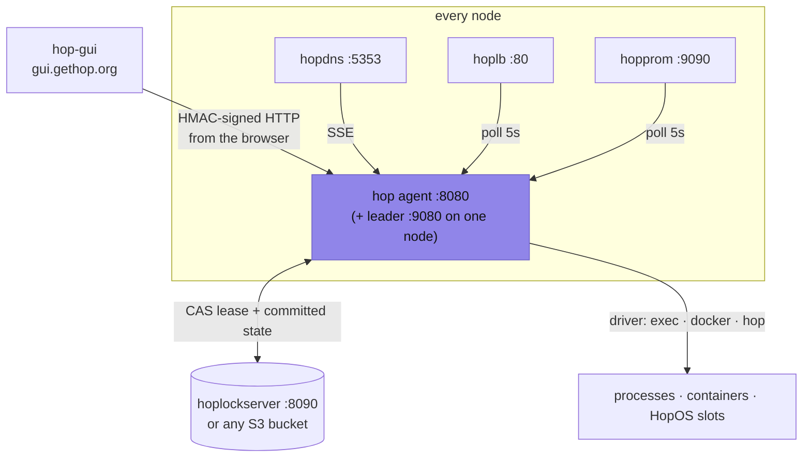

# Hop Documentation

Hop is a lightweight cluster orchestrator in Go — a simple alternative to
Nomad. One binary runs the cluster: agent, leader and HTTP API in a single
process. Jobs run as plain processes (`exec`), Docker containers (`docker`),
or native app images on HopOS metal (`hop`).

## Quick start

```bash
# Build
go build -o bin/agent ./cmd/agent
go build -o bin/run ./cmd/cli

# Run a single-node cluster (no other services needed)
./bin/agent --standalone --cluster=dev

# Deploy something
./bin/run apply --name hello --command "echo hello"
./bin/run status
```

From there: add nodes by pointing agents at a shared lock backend
(hoplockserver or any S3 bucket), put a real `api_key` in the config, and
manage it all from the hosted dashboard at
[gui.gethop.org](https://gui.gethop.org).

## Guides

| Doc | What it covers |
|-----|----------------|
| [architecture.md](architecture.md) | How it fits together: leader election (hoplock), committed state in S3, registration & settle period, reconciliation, the three runners |
| [api.md](api.md) | HTTP API reference — HMAC auth (`X-Hop-Auth`), leader endpoints (`/v1/*`), agent endpoints, SSE events |
| [cli.md](cli.md) | The `run` CLI: `apply`, `delete`, `status`, `agents`, `logs` |
| [configuration.md](configuration.md) | Config (JSON) & flags: node, cluster.lock backends, capacity, paths, isolation, timeouts |
| [data-structures.md](data-structures.md) | Core types: Job, Task, Agent — fields, states and semantics |
| [lifecycles.md](lifecycles.md) | Step-by-step lifecycles with invariants: task birth/restart/death, leader settle, chroot & cgroup details |
| [development.md](development.md) | Building, testing locally, project structure, dependencies |

## Quick pointers

- **Auth:** every endpoint except `/health` and `/leader` requires an HMAC
  signature (`X-Hop-Auth`); the shared key never travels on the wire. Empty
  key = auth off (dev). → [api.md](api.md#authentication-x-hop-auth)
- **Ports:** agent `:8080`, leader `:9080` (agent port + 1000),
  hoplockserver `:8090`. → [configuration.md](configuration.md)
- **Job upsert:** the job *name* is the unique key — `POST /v1/jobs` (or
  `run apply`) with an existing name performs a rolling/recreate/blue-green
  update. → [api.md](api.md#jobs)
- **Failover:** leader crash → new leader elected via CAS lease, ~60s worst
  case until all jobs are re-reconciled. → [architecture.md](architecture.md)
- **Web UI:** hosted at [gui.gethop.org](https://gui.gethop.org) — static
  page, your browser talks to your agent directly (HMAC-signed).

## Beyond this repo

Hop is part of a small suite (each with its own repo/README):



| Project | Role |
|---------|------|
| [**hopdns**](https://github.com/xinix00/hopdns) | DNS service discovery (`myapp.hop.local`), federation across clusters |
| [**hoplb**](https://github.com/xinix00/hoplb) | HTTP load balancer driven by `hoplb-urlprefix` job tags |
| [**hopprom**](https://github.com/xinix00/hopprom) | Prometheus exporter for cluster health |
| [**hoplockserver**](https://github.com/xinix00/hoplockserver) | Minimal CAS lease store (the default lock backend) |
| [**hop-gui**](https://github.com/xinix00/hop-gui) | The web dashboard (also hosted at [gui.gethop.org](https://gui.gethop.org)) |
| [**HopOS**](https://github.com/xinix00/HopOS) | The Go-only OS; hop schedules onto it via the `hop` driver |

Security model and threat analysis: see `SECURITY.md` in the monorepo root.
